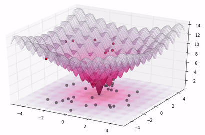
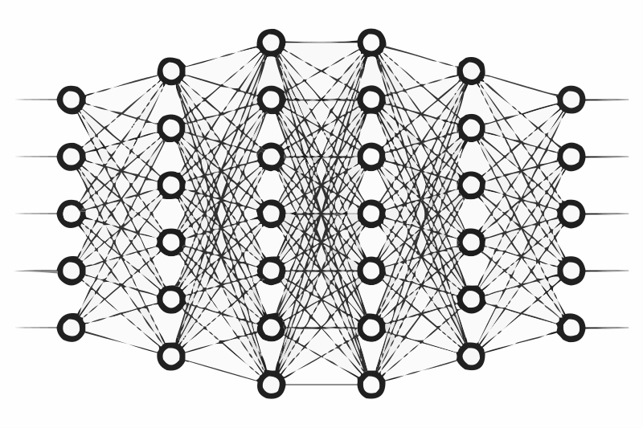
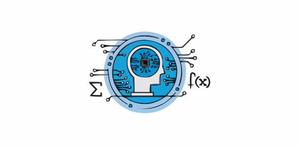
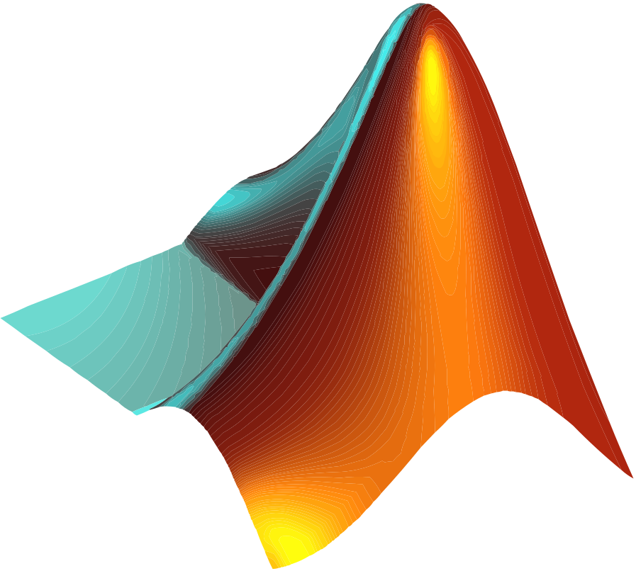

 

## Topics

-  Data Science and Analytics
-  Deep Learning
-  Operations Research
-  Machine Learning
-  Mathematics
-  Numerical Optimization

 

## Programming Languages

 

## Frameworks and libraries

### Machine Learning

 

### Optimization

 

### Software

 

## Tools

 

## Stats

 

## Find me

